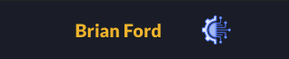
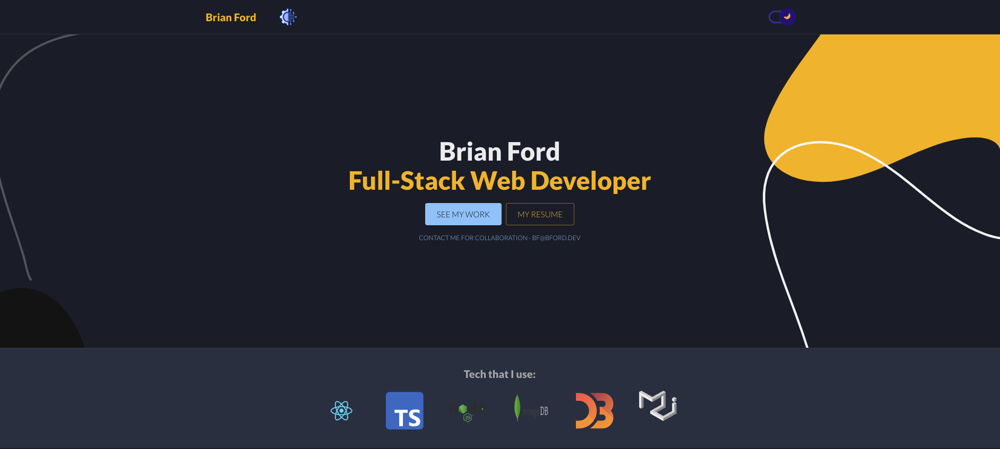
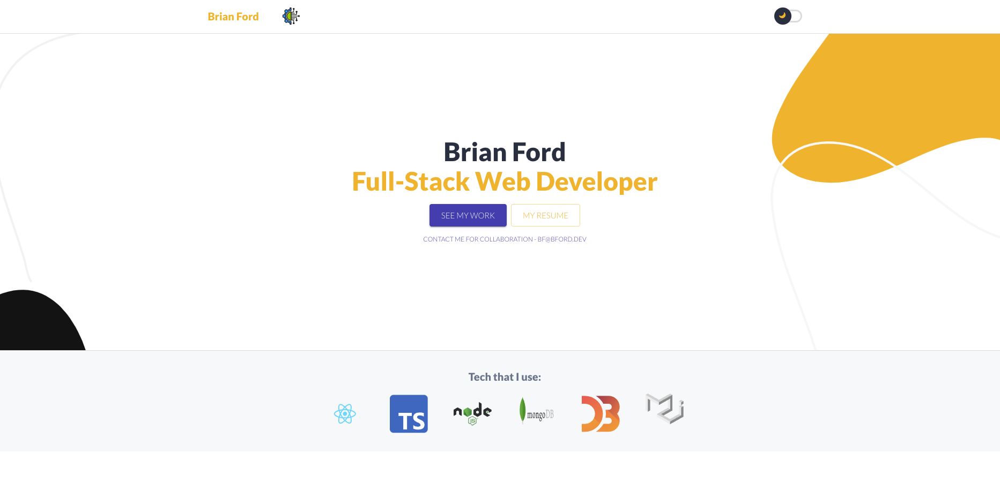
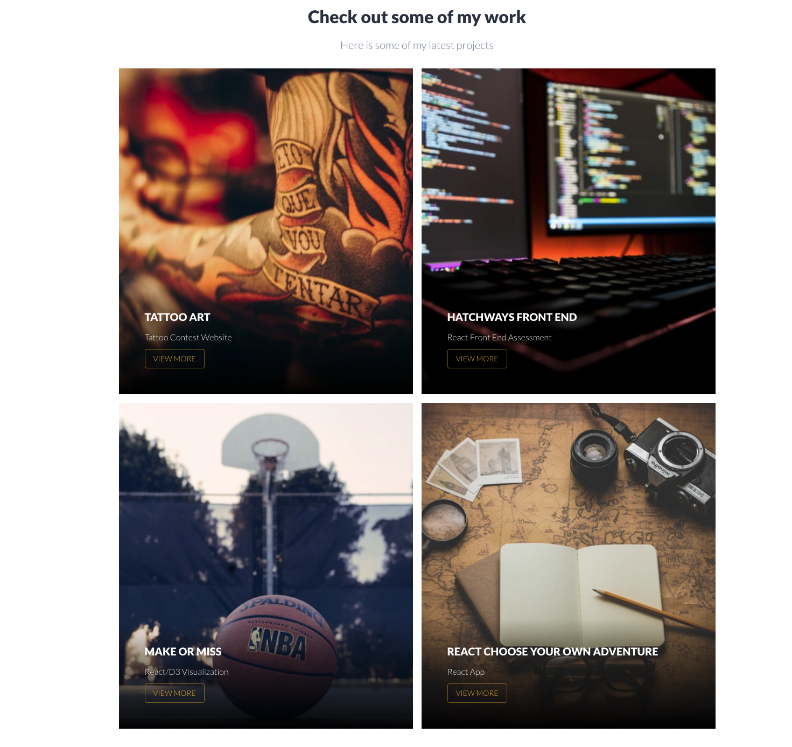

#Portfolio Page

[![Contributors][contributors-shield]][contributors-url]
[![Forks][forks-shield]][forks-url]
[![Stargazers][stars-shield]][stars-url]
[![Issues][issues-shield]][issues-url]
[![MIT License][license-shield]][license-url]
[![LinkedIn][linkedin-shield]][linkedin-url]


<!-- PROJECT LOGO -->
<br />
<p align="center">
  <a href="https://github.com/bf2344/WebDevGuy/">
    
  </a>

  <h3 align="center">Portfolio Page</h3>

  <p align="center">
    This is a Portfolio created by me to showcase my skills and work as a developer.
    <br />
    <a href="https://github.com/bf2344/WebDevGuy"><strong>Explore the docs »</strong></a>
    <br />
    <br />
    <a href="https://bf2344.netlify.app/">View Demo</a>
    ·
    <a href="https://github.com/bf2344/WebDevGuy/issues">Report Bug</a>
    ·
    <a href="https://github.com/bf2344/WebDevGuy/issues">Request Feature</a>
  </p>
</p>


<!-- TABLE OF CONTENTS -->
<details open="open">
  <summary>Table of Contents</summary>
  <ol>
    <li>
      <a href="#about-the-project">About The Project</a>
      <ul>
        <li><a href="#built-with">Built With</a></li>
      </ul>
    </li>
    <li>
      <a href="#getting-started">Getting Started</a>
      <ul>
        <li><a href="#prerequisites">Prerequisites</a></li>
        <li><a href="#installation">Installation</a></li>
      </ul>
    </li>
    <li><a href="#usage">Usage</a></li>
    <li><a href="#roadmap">Roadmap</a></li>
    <li><a href="#contributing">Contributing</a></li>
    <li><a href="#license">License</a></li>
    <li><a href="#contact">Contact</a></li>
    <li><a href="#acknowledgements">Acknowledgements</a></li>
  </ol>
</details>


<!-- ABOUT THE PROJECT -->
## About The Project

[![Product Name Screen Shot][product-screenshot]]()


### Built With

This Project was built with the following technologies and libraries. See the documentation for further information on these technologies.

* [React](https://getbootstrap.com)
* [TypeScript](https://jquery.com)
* [Material UI](https://jquery.com)


<!-- GETTING STARTED -->
## Getting Started

### Prerequisites

cd into folder and npm install 

* npm
  ```sh
  npm install 
  ```

<!-- USAGE EXAMPLES -->
## Usage

Toggle your preference of light mode vs dark mode





Check out some of my projects here




<!-- ROADMAP -->
## Roadmap

See the [open issues](https://github.com/othneildrew/Best-README-Template/issues) for a list of proposed features (and known issues).


<!-- CONTRIBUTING -->
## Contributing

Contributions are what make the open source community such an amazing place to be learn, inspire, and create. Any contributions you make are **greatly appreciated**.

1. Fork the Project
2. Create your Feature Branch (`git checkout -b feature/AmazingFeature`)
3. Commit your Changes (`git commit -m 'Add some AmazingFeature'`)
4. Push to the Branch (`git push origin feature/AmazingFeature`)
5. Open a Pull Request


<!-- LICENSE -->
## License

There is no license assigned to this project.


<!-- CONTACT -->
## Contact

Brian Ford - [LinkedIn](https://www.linkedin.com/in/bf2344) - bf@bford.dev

Project Link: [Portfolio Brian Ford](https://bf2344.netlify.app)


<!-- MARKDOWN LINKS & IMAGES -->
<!-- https://www.markdownguide.org/basic-syntax/#reference-style-links -->
[contributors-shield]: https://img.shields.io/github/contributors/bf2344/WebDevGuy.svg?style=for-the-badge
[contributors-url]: https://github.com/bf2344/WebDevGuy/graphs/contributors
[forks-shield]: https://img.shields.io/github/forks/bf2344/WebDevGuy.svg?style=for-the-badge
[forks-url]: https://github.com/bf2344/WebDevGuy/network/members
[stars-shield]: https://img.shields.io/github/stars/bf2344/WebDevGuy.svg?style=for-the-badge
[stars-url]: https://github.com/bf2344/WebDevGuy/stargazers
[issues-shield]: https://img.shields.io/github/issues/obf2344/WebDevGuy.svg?style=for-the-badge
[issues-url]: https://github.com/bf2344/WebDevGuy/issues
[license-shield]: https://img.shields.io/github/license/bf2344/WebDevGuy.svg?style=for-the-badge
[license-url]: https://github.com/bf2344/WebDevGuy/blob/master/LICENSE.txt
[linkedin-shield]: https://img.shields.io/badge/-LinkedIn-black.svg?style=for-the-badge&logo=linkedin&colorB=555
[linkedin-url]: https://linkedin.com/in/bf2344
[product-screenshot]: ./readme/main.png